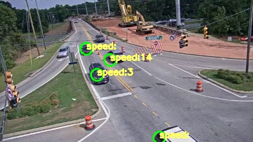
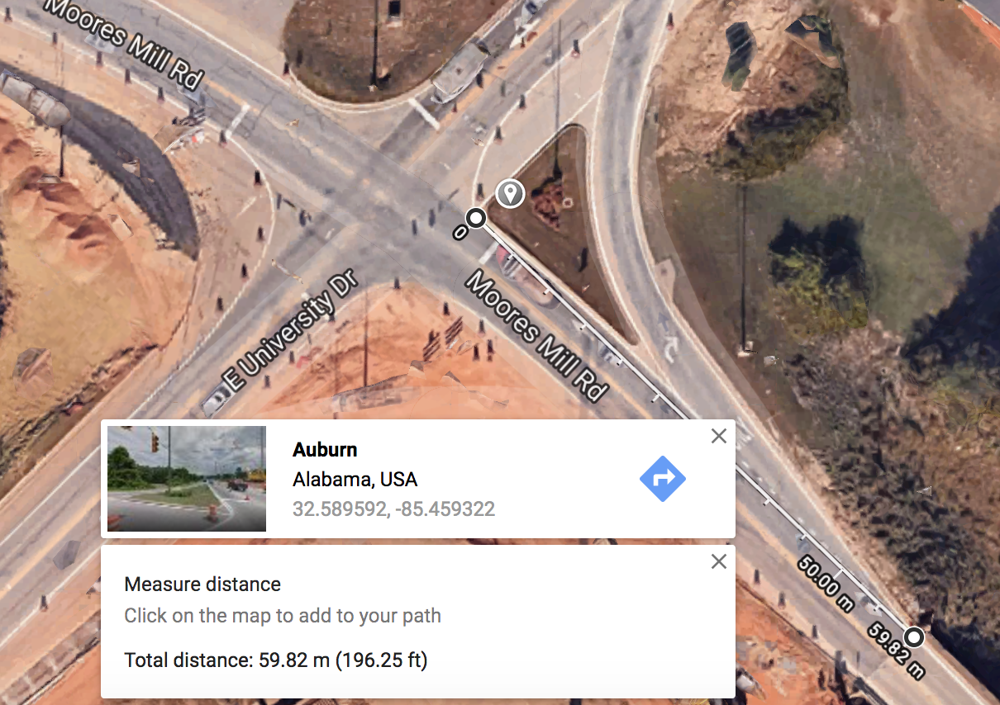
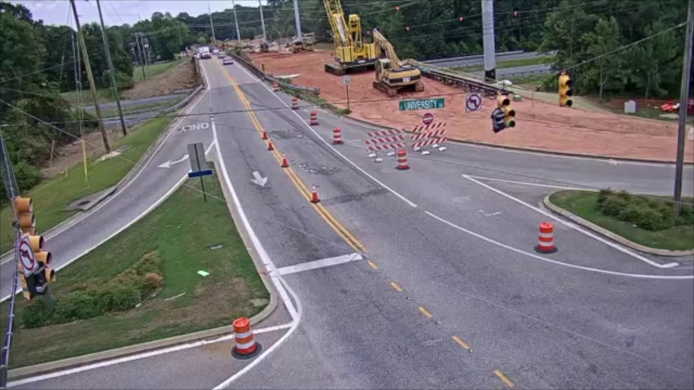
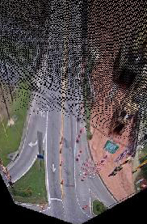

# Nazarbayev University Image Processing Spring 2019 Final Project

### About

This repository contains the implementation of the final project for Image Processing course at Nazarbayev University by Bolat Tleubayev and Zhanel Zhexenova in 2019

The idea behind the project is to create speed estimation system with the minimum use of library functions. We only used OpenCV for frame reading and character overlay, all other functions were implemented manually

  

The video was taken from the camera of the city of Auburn, Alabama, USA. We also used Google Maps to get the exact length of the road segment

  

### Pipeline

The car detection algorithm is based on background subtraction, we subtract the clear background from every frame to obtain binary image for further processing

  

We also define a Region Of Interest (road) by two other images that we use for finding cars on the frame

  
  

After segmenting cars from the background we  applied homography transform to calculate the speed in real world

  

### Requirements

To run this notebook you need following libraries:

* _OpenCV_ - to handle video opening, text overlay
* _numpy_ - for math
* _numba_ - for better performance 
* _matplotlib_ - for image display
